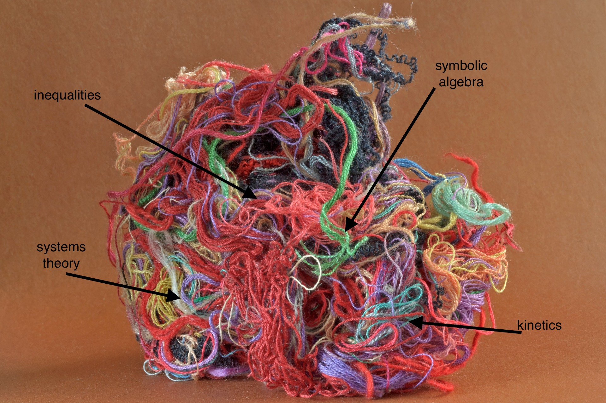
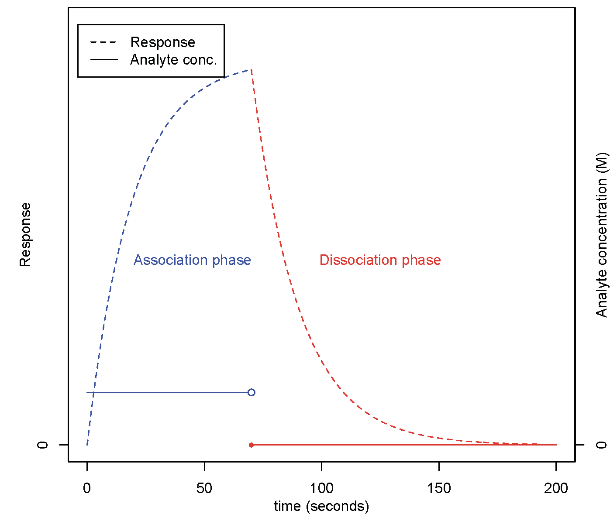

```{r setup, include=FALSE}
knitr::opts_chunk$set(echo = FALSE)
```

```{r tangle, fig.align="center", fig.cap='My work feels like this sometimes...',  out.width='0.75\\linewidth', fig.pos='H'}

```

## Structural global identifiability (SGI)? <br>
This concept lurks wherever we wish to "calibrate" a model structure (estimate parameters from data) so that we can proceed to make predictions. <br>

Often we can represent a physical system by a structure of "state-space" systems. These relate state variables (**x**),
observables (**y**) and possibly inputs (**u**) through parametric expressions in the parameters $\boldsymbol{\theta}$:
\begin{gather}
\dot{\bf x}({\bf x}, {\bf u}, t; {\boldsymbol{\theta}}) = {\bf f}({\bf x}, {\bf u}, t; {\boldsymbol{\theta}}) \, , \quad {\bf x}(0) = {\bf x_{0}}(\boldsymbol{\theta}) \\
{\bf y}({\bf x}, {\bf u}, t; {\boldsymbol{\theta}}) = {\bf g}({\bf x}, {\bf u}, t; {\boldsymbol{\theta}}) \, .
\end{gather}
Suppose we have an infinite, error-free record of data, and a correctly specified model structure (composed of parametric relationships between variables). Is it possible to obtain a unique estimate for each parameter?
If not, and if alternative parameter estimates produce very different predictions, we cannot make predictions with confidence. This may cause our study to be an unproductive use of time, effort, and resources. 

I have considered the problem for model structures used in various biological settings.

## Analysis of linear switching systems representing (e.g.) biosensor data: <br>
Optical biosensor experiments^[For a cool video introduction, look [here](https://www.youtube.com/watch?v=h6z_1rAaduE&t=9s)] provide a means of indirectly observing the interactions of biomolecular species in real time. The experimental setup features an _immobilised analyte_ bound to a sensor surface, and an _analyte_ in solution made to flow over this surface. A series of "kinetic" experiments aim to determine the rate constants of interactions. Experiments typically consist of two or more phases, delineated by a change in experimental conditions. For example, in the _association_ phase, some concentration of analyte is made to flow over the surface for a specified time. 
In the _dissociation_ phase, the solution is changed to buffer (zero analyte concentration).

In certain cases, the experimental output is appropriately modelled by a linear switching system (LSS). A LSS is a collection of linear time-invariant state-space systems, with a switch that determines which system is in effect at each time point. A schematic of the LSS output is shown in 
Figure \@ref(fig:BIAcore-response-sample) below.

```{r BIAcore-response-sample, fig.align="center", fig.cap='A schematic of optical biosensor response for an experiment of tho phases, with the change in injected analyte concentration shown.',  out.width='0.75\\linewidth', fig.pos='H'}

```
As standard methods in identifiability testing and parameter estimation are not appropriate for an LSS structure, it is necessary to design other methods.

See the abstract of my PhD thesis:^[Won't you?] <br>
  ["Global _a priori_ identifiability of models of flow-cell optical biosensor experiments"](https://www.cambridge.org/core/journals/bulletin-of-the-australian-mathematical-society/article/global-a-priori-identifiability-of-models-of-flowcell-optical-biosensor-experiments/E2514E38B97CACCAAA6578E26A2029F5#fndtn-metrics), Bulletin of the Australian Mathematical Society 98, no. 2 (2018): 350-352.


### Publications 
#### Recent publications on identifiability analysis

* Whyte, Jason M. [**"Branching out into Structural Identifiability Analysis with Maple: Interactive Exploration of Uncontrolled Linear Time-Invariant Structures."**](https://doi.org/10.1007/978-3-030-81698-8_27) in "Maple in Mathematics Education and Research. MC 2020", pp. 410--428, 2021. Communications in Computer and Information Science, vol 1414. Springer, Cham. (The arXiv preprint is available [here](https://arxiv.org/abs/2103.11309)) 

* Whyte, Jason M. [**"Model Structures and Structural Identifiability: What? Why? How?"**](https://doi.org/10.1007/978-3-030-62497-2_10), in 2019-20 MATRIX Annals, MATRIX Book Series, 2021, 185–213.

#### Recent publications on aspects of disease modelling
* Zaloumis, Sophie G., Jason M. Whyte, Joel Tarning, Sanjeev Krishna, James M. McCaw, Pengxing Cao, Michael T. White et al. [**"Development and validation of an in silico decision-tool to guide optimisation of intravenous artesunate dosing regimens for severe falciparum malaria patients."**](https://doi.org/10.1128/AAC.02346-20), Antimicrobial Agents and Chemotherapy 65, no. 6 (2021).

* Alahmadi, Amani, Sarah Belet, Andrew Black, Deborah Cromer, Jennifer A. Flegg, Thomas House, Pavithra Jayasundara et al. [**"Influencing public health policy with data-informed mathematical models of infectious diseases: Recent developments and new challenges."**](https://doi.org/10.1016/j.epidem.2020.100393), Epidemics 32 (2020): 100393.

### Code contributions
#### Maple
* Whyte, J. M., [**“Maple 2020 procedures and a dashboard for interactive testing of uncontrolled linear-time-invariant structures for structural global identifiability”**](https://maple.cloud/app/5312540069855232/Maple+2020+procedures+and+a+dashboard+for+interactive+testing+of+uncontrolled+linear-time-invariant+structures+for+structural+global+identifiability), available online March 31st 2021.

*	Whyte, J. M., [**“Drawing a compartmental diagram for an uncontrolled linear, time-invariant structure”**](https://maple.cloud/app/5380800117211136/Drawing+a+compartmental+diagram+for+an+uncontrolled+linear%2C+time-invariant+structure), software for Maple Conference 2020, Dec 30 2020.

#### R Shiny Apps
* Whyte, J. M., [**"An illustration of parameter value non-uniqueness for a model used to describe Biacore biosensor data obtained under a four-parameter form of the 'simple bimolecular' interaction"**](https://jmwhyte.shinyapps.io/4parameter_simple-bimolecular-int_ex/?_ga=2.124313731.802085833.1600240688-835245775.1600240688)

### Talks and posters on identifiability analysis

[**"My Enemy, My Ally: how useful is this mathematical model?"**](https://www.youtube.com/watch?v=LX4A9Yq1qnY), talk presented at the ARC Centre of Excellence for Mathematical & Statistical Frontiers (ACEMS) Early-Career Researcher Retreat, November 3rd, 2020. <br>
_Talk begins with a brief comparison of mathematics and science fiction._

**“Branching out into structural identifiability analysis with Maple”**, Maple Conference 2020 (online), Nov 2nd 2020.

**“Frustrated mathematical modelling and changeable destinies: Structural identifiability analysis of models to support useful results”**, Seminario de Investigación Interdisciplinar para la Innovación en Ciencia y Tecnología, (SICTE Interdisciplinary research, Catholic University of the North, Chile), invited oral presentation
 online, Oct 20th 2020.

**“An introduction to the testing of model structures for global a priori identifiability (with examples drawn from Plasmodium falciparum malaria modelling)”**, invited oral presentation for Influencing Public Health Policy with Data-informed Mathematical Models of Infectious Diseases, Creswick, Victoria, July 1st 2019.

**“Biological modelling, and rarely asked questions of the 21st century”**, poster presentation, 
BioInfoSummer, University of Western Australia, Perth, December 3rd 2018.

**“Biological modelling, and rarely asked questions of the 21st century”**, poster presentation, Australian Bioinformatics and Computational Biology Society Conference, Melbourne, November 26th 2018.

#### Work in progress
Whyte, J. M. **"Structural minimality of linear swtiching system structres, as motivated by flow-cell optical biosensors and biomolecular interactions"**


